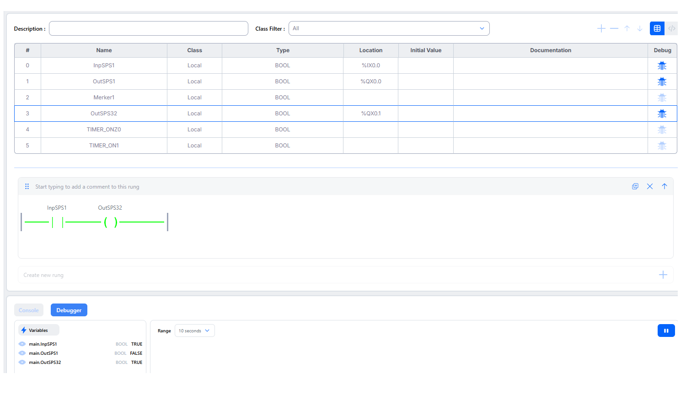

# Dokumentation: Inbetriebnahme und SPS-Programmierung mit OpenPLC V4.2.9 und ESP32

## 1. Übersicht & Versionswechsel
* **Ausgangssituation:** Bei der Nutzung des OpenPLC Editors V4.1 traten massive Verbindungsprobleme (API-Fehler, JWT-Token-Fehlermeldungen und Versionskonflikte) mit der lokalen Windows-Runtime auf.
* **Lösung:** Migration auf den aktuellen **OpenPLC Editor V4.2.9**. 
* **Vorteil:** Die Version 4.2.9 integriert die Simulationsumgebung direkt als auswählbares Zielgerät (*Device*), wodurch eine separate, fehleranfällige Hintergrund-Runtime unter Windows für Funktionstests komplett überflüssig wird.

---

## 2. Hardware-Inbetriebnahme (ESP32 WROOM)
Für die physikalische Umsetzung wird ein ESP32 WROOM verwendet. Die OpenPLC-Laufzeitumgebung wird dabei direkt als Firmware auf den Mikrocontroller geflasht. Eine lokale Windows-Runtime ist für den Betrieb nicht erforderlich.

### Physisches Pin-Mapping (E/A-Konfiguration)
Die Zuordnung der SPS-Adressen zu den echten Hardware-Pins des ESP32 ist wie folgt definiert:

| SPS-Adresse | Datentyp | ESP32 GPIO-Pin | Peripheriegerät | Verdrahtungshinweis |
| :--- | :--- | :--- | :--- | :--- |
| **%IX0.0** | BOOL | **GPIO 18** | Schalter / Taster | Schaltet gegen GND (Nutzt internen Pull-Up) |
| **%QX0.0** | BOOL | **GPIO 13** | LED 1 | Vorwiderstand (220-330 Ω) gegen GND erforderlich |
| **%QX0.1** | BOOL | **GPIO 13** | LED 2 (OutSPS32) | Vorwiderstand (220-330 Ω) gegen GND erforderlich |

---

## 3. Workflow im OpenPLC Editor V4.2.9
Um ein Programm erfolgreich zu erstellen, zu testen und zu visualisieren, wurde folgende Schritt-für-Schritt-Reihenfolge erarbeitet:

### Schritt 1: Programmierung & Variablen-Deklaration
1. Erstellen der Programmlogik im Kontaktplan (KOP / Lad-Diagramm).
2. Vergabe der symbolischen Namen und Zuweisung der physischen Adressen (Locations wie `%IX0.0`).

### Schritt 2: Vorbereitung für das Live-Debugging
* **Wichtigste Erkenntnis:** Damit Variablen im späteren Betrieb live beobachtet werden können, muss **vor dem Kompilieren und Hochladen** das Debug-Symbol (die blaue Brille) in der Spalte *Debug* ganz rechts in der Variablentabelle für jede gewünschte Zeile aktiv angewählt werden.
* Ausgegraute Symbole werden von der Hardware nicht übertragen, um Prozessorleistung und Übertragungsbandbreite zu sparen.

### Schritt 3: Kompilierung & Upload
1. Verbindung des ESP32 via USB-Kabel mit dem Windows 11 PC.
2. Auswahl des passenden COM-Ports im Editor.
3. Übertragung des Programms. Der erfolgreiche Abschluss wird in der Konsole mit `[Zeitstempel]: Arduino upload complete.` bestätigt. Das Programm läuft ab diesem Moment autark auf dem Chip.

### Schritt 4: Live-Status im Editor überwachen
1. Klicken auf den **Connect-Button**, um die serielle Schnittstelle zum ESP32 zu öffnen.
2. Aktivieren des **Auge-Symbols** in der oberen Menüleiste, um den Debug-Modus zu starten.

---

## 4. Analyse des laufenden Systems (Live-SPS-Status)

Das folgende Abbild zeigt den erfolgreichen Debug-Betrieb des erstellten Programms:

### Status-Auswertung des Screenshots:
* **Eingang `InpSPS1` (%IX0.0):** Steht live auf `TRUE`. Im Kontaktplan ist die Zuleitung grün eingefärbt. Dies bedeutet, dass der physische Schalter an GPIO 18 aktuell geöffnet ist (Signal wird durch den internen Pull-Up auf High gezogen).
* **Ausgang `OutSPS32` (%QX0.1):** Wird direkt vom Eingang angesteuert und steht folglich ebenfalls auf `TRUE`. Die Spule im Kontaktplan leuchtet grün.
* **Hardware-Reaktion:** Die an **GPIO 32** angeschlossene LED leuchtet physisch auf dem Board.
* **Debugger-Panel:** Unten links im Fenster *Debugger* werden die Variablen `main.InpSPS1` und `main.OutSPS32` in Echtzeit mit dem Wert `TRUE` gelistet.

---

## 5. Zukunftsoptionen & Erweiterungen
* **Modbus TCP/RTU:** Industrielle Kommunikationsprotokolle müssen für diesen autarken Direktbetrieb nicht aktiviert werden. Sie werden erst notwendig, sobald der ESP32 Daten mit externen HMI-Bildschirmen, SCADA-Systemen oder Node-RED austauschen soll.
* **Zeitfunktionen:** Als nächste Ausbaustufe ist die Integration von Timern (`TON` / `TOF`) vorbereitet, um Zeitverzögerungen oder Blinkzeichen zu realisieren.
* **werde einsetzen für umfangreichere logische Schaltungen auf Controller(ESP32)**

